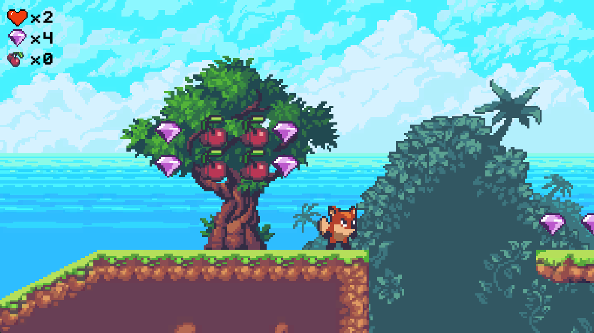

# UnityVisualScriptingPlatformerDemo

Platformer demo made with Unity Visual Scripting.

Used assets:
- Sunny Land by ansimuz: https://opengameart.org/content/sunny-land-2d-pixel-art-pack
- Pixel heart by Nicole Marie T: https://nicolemariet.itch.io/pixel-heart-animation-32x32-16x16-freebie
- Pixel font by kheftel: https://opengameart.org/content/minimalist-pixel-fonts
Show less
